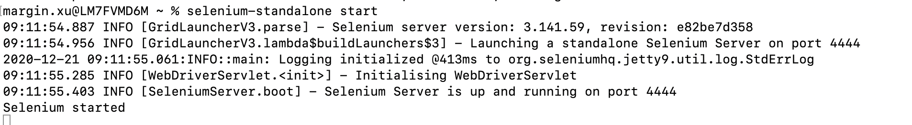
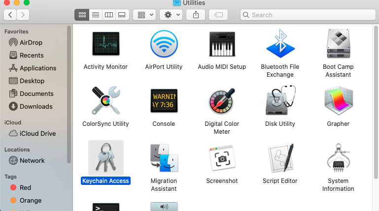
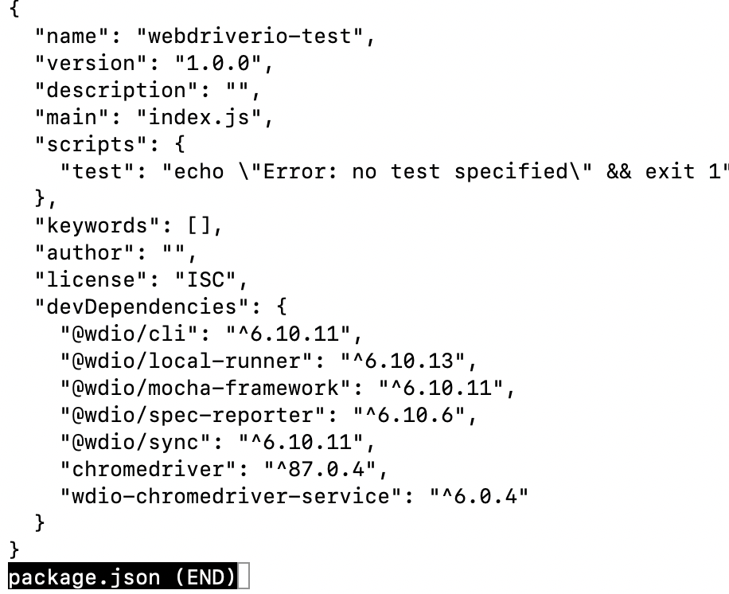

# ▶selenium-standalone

【Official Website】https://www.npmjs.com/package/selenium-standalone

【Github】https://github.com/vvo/selenium-standalone

- 安装chrome driver

  - 测试工具与浏览器之间的交互，相当于是连接适配器

  ```shell
  brew tap homebrew/cask && brew cask install chromedriver
  ```

- 安装java环境

- 安装selenium-standalone

```shell
npm install selenium-standalone -g
```

- 安装并运行

```shell
#指定安装chrome的插件
selenium-standalone install --drivers.chrome.version=87.0.4280.20 --drivers.chrome.baseURL=https://chromedriver.storage.googleapis.com
#全部安
selenium-standalone install
#启动运行
selenium-standalone start
```

- 运行成功



- 异常结束，杀死selenium-standalone进程

```shell
pkill -f selenium-standalone
```

*keychain Access 打开方式



# ▶webdriverIO

【Official Website】https://webdriver.io/

【Github】https://github.com/webdriverio/webdriverio

【API学习文档】https://webdriver.io/docs/api.html

- 确保安装了node

```shell
node -v
```

- 初始化一个npm项目

```shell
mkdir webdriverio-test && cd webdriverio-test
npm init -y
```

- 安装CLI

```shell
npm i --save-dev @wdio/cli
```

- 生成配置文件

```shell
npx wdio config -y
```

- 查看配置文件

```shell
less package.json
```




- 创建测试样例的文件夹

```shell
mkdir -p ./test/specs
```

- 创建一个新的文件

```shell
touch ./test/specs/basic.js
#打开文件
open ./test/specs/basic.js
#添加以下东西
describe('webdriver.io page', () => {
    it('should have the right title', () => {
        browser.url('https://webdriver.io')
        expect(browser).toHaveTitle('WebdriverIO · Next-gen browser and mobile automation test framework for Node.js');
    })
})
```

- 跑测试样例

```shell
npx wdio wdio.conf.js
```


# ▶ava

【Github】https://github.com/avajs/

- 安装ava

```shell
npm init ava
```

- 创建ava文件

```shell
const test = require('ava');

```

- 通过npm运行

```shell
npm test
```


# ▶jenkins(CI/CD pipeline)

【GitHub】https://github.com/jenkinsci/

