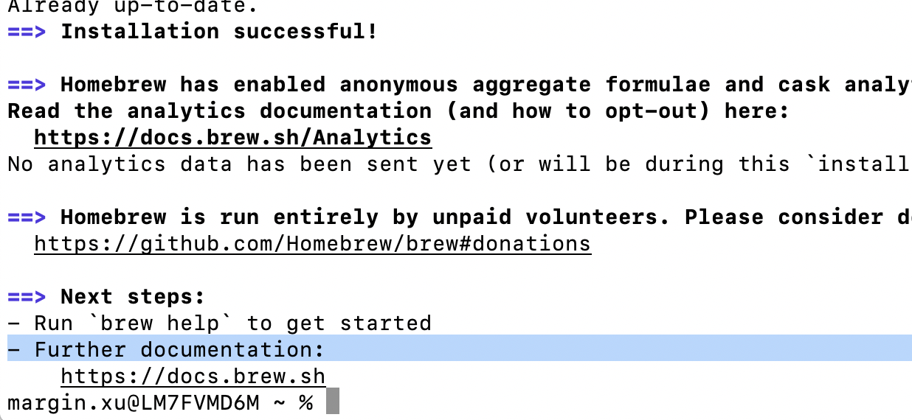

# ▶Mac条件下安装node(npm)

**【For first time to us Mac os system】**

1、打开terminal,安装home-brew,是Mac os软件管理的工具包。

```shell
ruby -e "$(curl -fsSL https://raw.githubusercontent.com/Homebrew/install/master/install)"
```



2、通过brew进行代码的安装

```shell
brew install node
    执行以下命令查看是否安装成功
    node -v:查看node版本
    npm -v：查看npm版本
```

# ▶官方教程及学习资源

中文版：https://www.tslang.cn/samples/index.html

英文版：https://www.typescriptlang.org/docs/

【项目】微信小程序的构建：https://github.com/Microsoft/TypeScript-WeChat-Starter#%E5%BC%80%E5%A7%8B%E4%B9%8B%E5%89%8D

【学习资源-掘金】https://juejin.cn/post/6844903680295043086

【ES 6 学习资料】https://es6.ruanyifeng.com/#docs/promise


# 一、初步安装

## 自动编译问题的解决

### 1、安装typescript

```shell
npm install typescript --save-dev -g
#加一个-g是一个全局的表示
```

### 2、设置自动编译

```shell
tsc --init //生成ts.json自动编译文件
tsc -w //设置监听
```

### 3、node.js安装

https://juejin.cn/post/6844903886541553672

## 文件运行编译查看结果的方法

- ts-node 方法
  - 该方法直接运行ts文件即可

```shell
//安装全局的ts-node工具
npm install -g ts-node
//直接通过ts-node对ts方法进行运行和编译
ts-node test.ts
```

- tsc编译再通过node运行方法
  - 该方法需要编译成js文件，之后再进行node的运行

```shell
//先通过tsc进行ts文件的编译成js
tsc test.ts
//再通过node对js文件进行运行
node test.js
```


# 二、基本语法学习

## 1、数据类型

var 可以换成 let

布尔类型（boolean）

```typescript
var flag:boolean = false
```

数字类型（number）

- 没有对类型进行区分 

```typescript
var num:number = 12
```

字符串类型（string）

```typescript
var str:string = "str"
```

数组类型（array）

```typescript
let arrays:number[] = [1,2,3,4,5]
let strings:string[] = ["java","python"]
//范型定义方法
let arrays:Array<number> = [12,3,4]
```

元组类型（tuple）

```typescript
let tuple:[string,num,boolean]=["ts",23,false]
```

枚举类型（enum）

```typescript
enum Flag = {success = 1,error = 0}
let f:Flag = Flag.success
```

任意类型（any）

```typescript
var num:any = 1
any = "tree"
```

null 和 undefined

- 其他任务类型的子类型

```typescript
//不能通过
var num:number
console(num)
//可以通过
var num:undefined
console.log(num)
//这样使用也可以
var num:number|undefined
//null使用也一样
var num:number|undefined|null
```

void 类型

```typescript
//表示方法没有返回任何类型
function run():void{
  console.run()
}
```

never 类型

- 上面的null和undefined都是子类型
- 代表从不会出现的值

```typescript
//常用于抛出异常的场景
var a:never
a = (()=>{
  throw new Error("错误")；
})
```

## 2、数据对象

### *引入es6

- 解决map、set对象的不正确


- Number对象

  - 语法

  ```typescript
  var num = new Number(value)
  ```

  - 对象属性
    - MAX_VALUE（最大值）、MIN_VALUE（最小值）、NEGATIVE_INFINITY（负无穷大）、POSITIVE_INFINITY（正无穷大）
  - 常用方法
    - toString() 把数字转换为字符串
    - valueOf 返回一个Number对象的原始值

- String对象
  - 语法

  ```typescript
  var txt = new String('string'); // 同var txt = "string"
  ```

  - 对象属性
    - length(长度)
  - 常用方法
    - charAt() 返回在指定位置的字符
    - concat() 连接两个或更多字符串，并返回新的字符串
    - indexOf() 返回某个指定的字符串值在字符串中首次出现的位置
    - lastIndexOf() 从后向前搜索字符串，并从起始位置（0）开始计算返回字符串最后出现的位置
    - substring() 提取字符串中两个指定的索引号之间的字符
    - toString() 返回字符串
    - valueOf() 返回指定字符串对象的原始值
    - match() 查找找到一个或多个正则表达式的匹配
    - search() 检索与正则表达式相匹配的值

- Array对象（同数据类型的数组）

- Map对象

  - 语法

  ```
  var myMap = new Map();
  ```

  - 常用方法
    - clear() 移除 Map 对象的所有键/值对
    - set() 设置键值对，返回该 Map 对象
    - get() 返回键对应的值，如果不存在，则返回 undefined
    - has() 返回一个布尔值，用于判断 Map 中是否包含键对应的值
    - delete() 删除 Map 中的元素，删除成功返回 true，失败返回 false
    - size() 返回 Map 对象键/值对的数量
    - keys() 返回一个 Iterator 对象， 包含了 Map 对象中每个元素的键
    - values() 返回一个新的Iterator对象，包含了Map对象中每个元素的值

## 3、语句结构

- 条件语句（同java）

  - if else 
  - if ...else if.... else if...
  - switch(expression)  case ... case ... default

- 循环语句

  - for（init ; condition; increment）

  - for ( var val in list)

  - for...of

    ```typescript
    let someArray = [1, "string", false];
    for (let entry of someArray) {
        console.log(entry); // 1, "string", false
    }
    ```

  - forEach

    ```typescript
    let list = [4, 5, 6];
    list.forEach((val, idx, array) => {
        // val: 当前值
        // idx：当前index
        // array: Array
    });
    ```

  - every

    ```typescript
    let list = [4, 5, 6];
    list.every((val, idx, array) => {
        // val: 当前值
        // idx：当前index
        // array: Array
        return true; // Continues
        // Return false will quit the iteration
    });
    ```

  - while(同java) 和 do while

## 4、函数

- 函数声明法

```typescript
function run():string{
	return "str"
}
```

- 匿名函数声明法

```typescript
var fun2 = function():number{
    return 123;
}
```

- 带输入值和返回值

```typescript
function getInfo(name:string,age:number):string{
    return `${name}----${age}`;
}
```

- 匿名函数声明法2

```typescript
var fun2 = function getInfo(name:string,age:number):string{
		return `${name}----${age}`;
}
```

- 无任何返回值

```typescript
//表示方法没有返回任何类型
function run():void{
  console.run()
}
```

- 默认参数，可选参数

```typescript
//可选参数
//带个？号,注意?要小写
//可选参数
function getInfo(name:string,age?:number):string{
    if(age){
        return `${name}----${age}`;
    }else{
        return `${name}`;
    }
}
//默认参数，age带默认参数20
function getInfo(name:string,age:number = 20):string{
    if(age){
        return `${name}----${age}`;
    }else{
        return `${name}`;
    }
}
```

- 剩余参数

```typescript
//剩余参数
function sum(...result : number[]){//...result接受新传入的值
    var sum = 0;
    for(var i = 0;i < result.length;i++){
        sum += result[i];
    }
    return sum;
}
//第二种写法
function sum2(a:number,b:number,...result : number[]){//...result接受新传入的值
    var sum = 0;
    for(var i = 0;i < result.length;i++){
        sum += result[i];
    }
    return sum;
}
```

- 函数重载

和java略有区别，为了兼容es5和es6

```typescript
//函数重载
function show(name:string):string;
function show(num:number):number;
//需要加入一个any
function show(str:any):any{
    if(typeof str == 'string'){
        return '我的名字是'+str;
    }else{
        return '我的年龄是'+str;
    }
}
//可选择参数的说明
function read(bookName : string):string;
function read(bookName:string,date:number):string;
function read(bookName:any,date?:any):string{
    if(date){
        return '日期是' + date;
    }else{
        return '书名是' + bookName;
    }
}
read("张三") //正确
read(1234) / /错误
```

- 箭头函数

```typescript
//箭头函数
setTimeout(function(){},1000)
//省略function，采用=>进行函数的读取
setTimeout(()=>{},1000)
```

## 5、类

- 类的定义
  - class关键字
  - 和java一样有构造函数，利用construct即可
  - 类中的方法直接写即可，不需要function

```typescript
//ts中定义类,用class修饰，内部的方法不再需要使用function关键字
class Person{
    /**
     * 属性部分
     */
    name:string;
    /**
     * 构造函数
     * 创建对象实例化出发的方法 
     */
    constructor(n:string){
        this.name = n;
    }
    //类中的方法
    run():void{
        console.log(this.name);
    }
    getName(): string{
        return this.name;
    }
    //传入参数到给定参数
    setName(name:string):void{
        this.name = name;
    }
}

var p = new Person('张三');
console.log(p.getName());
p.setName('李四');
console.log(p.getName());
```

- 继承（和Java一样）
  - extends表示继承父类
  - super表示子类调用父类的构造函数
  - 父类和子类有同样的方法时，调用子类的实例对象时，优先调用子类的方法。

```typescript
class Person{
    /**
     * 属性部分
     */
    name:string;
    /**
     * 构造函数
     * 创建对象实例化出发的方法 
     */
    constructor(name:string){
        this.name = name;
    }
    //类中的方法
    run():string{
        return `${this.name}在运动`; 
    }
}

class superman extends Person{
    constructor(name:string){
        super(name);/*初始化调用父类的构造函数*/
    }
}
```

- 类中的访问修饰符（和Java一样）
  - public 公有
  - protected 保护类型，类外部中无法访问，子类可以访问
  - private 私有，子类、类外部中无法访问

- 静态方法和静态属性
  - 静态方法和属性的声明都是用static
  - 静态方法无法调用类中非静态变量，除非变量也用static关键字进行修饰

```typescript
class Animal{
    name:string;
    static way:string;
    constructor(nickname:string){
        this.name = nickname;
    }
    static run(){
        //调用非静态变量
        console.log(this.name);//无法调用
        //调用静态变量
        console.log(this.way);//成功调用
    }
}
```


- 多态（继承的一种）（同Java）
  - 即父类定义一个方法不去实现，让继承的子类去实现，每一个子类有不同的表现

```typescript
class Animal{
    name:string;
    constructor(name:string){
        this.name = name;
    }
    run(){
        
    }
}

class Dog extends Animal{
    constructor(name:string){
        //将传入的变量传给父类
        super(name);
    }
    run():string{
        return `${this.name}在奔跑`
    }
}
var d = new Dog("小黄");
console.log(d.run());
```

- 抽象方法和抽象类（同Java）
  - 用abstract关键字进行修饰
  - 抽象方法只能放在抽象类
  - 抽象类的子类必须包含抽象类中的所有抽象方法

```typescript
abstract class human{
    public name:string = '一';
    abstract run():any;
}

class superman extends human{
    //抽象类子类必须实现其子类方法
    run() {
        throw new Error("Method not implemented.");
    }
}
```

## 6、接口

通过Interface定义接口【ts中的接口用法比java要多得多】

- 属性类接口

  - 对json进行约束(es5内容，略)

    - 对自定义方法进行约束

    ```typescript
    function printLabel(labelInfo:{label:string}):void{
        console.log('printLabel');
    }
    //用labelInfo确定传出的类型
    var str = {label:'张三'}
    printLabel(str);
    ```

    - 对批量方法传入参数进行约束

    ```typescript
    var flName = {
        get:'haha',//在外部定义一个无关字段仍然可以传入
        firstName:'张三',
        secondName:'李四'
    };
    printName({
        get:'haha',//在内部定义一个无关字段无法传入
        firstName:'张三',
        secondName:'李四'
    });
    printName(flName);
    ```

  - 可选属性

  ```typescript
  //添加？即可
  interface FullName{
      firstName:string;
      secondName?:string;//可选参数
  }
  ```

  - 【例子】ts封装成ajax

  ```typescript
  interface Config{
      type:string;
      url:string;
      data?:string;
      dataType:string;
  }
  //原生js封装ajax
  function ajax(config:Config){
      var xhr = new XMLHttpRequest();
      xhr.open(config.type,config.url,true);
  
      xhr.send(config.data);
  
      xhr.onreadystatechange = function(){
          if(xhr.readyState == 4 && xhr.status == 200){
              console.log('成功');
              if(config.dataType == 'json'){
                  JSON.parse(xhr.responseText);
              }else{
                  console.log(xhr.responseText);
              }
          }
      }
  }
  //调用接口类型使用json格式
  ajax({
      type:'get',
      data:'name=zhangsan',
      url:'http:www.baidu.com',
      dataType:'json'
  })
  ```

  

- 函数类型接口

  - 功能：对方法传入的参数以及返回值进行约束
  - 加密的函数类型接口：定义的类型由接口进行封装

  ```typescript
  interface encrypt{
    	//应用这个接口的函数输入输出类型要符合规定
      (key:string,value:string):string;
  }
  //限制函数的输入输出类型
  var md5:encrypt = function(key:string,value:string):string{
      return key+value;
  }
  //模拟md5算法
  console.log(md5('ana','bob'));
  ```

- 可索引接口

  - 对数组约束

  ```typescript
  interface UserArr{
    	//index表示索引，后面冒号的表示value
      [index:number]:string
  }
  //使用UserArr定义数组的结构
  var arr:UserArr = ['dsadas','dasdas'];
  console.log(arr[0]);
  //错误写法
  var arr2:UserArr = [13123,'hdf'];
  ```

  - 对对象的约束

    - 这个地方比较细节，如果定义成数组的形式会造成错误，因为interface中定义的为string

    ```typescript
    interface UserObj{
        [index:string]:string
    }
    
    // var obj:UserObj = ['112312','321312'];//错误，因为不是数组
    var obj:UserObj = {taste:'张三'};
    ```

- 类的类型接口

  - 对类的约束，与抽象类类似（这块和Java相同）

  ```typescript
  interface Animal{
      name:string;
      eat(str:string):void;
  }
  //实现Animal接口
  class Dog implements Animal{
      eat(): void {
          console.log(this.name+'吃狗粮T-T')
      }
      name:string;
  
      constructor(name:string){
          this.name = name;
      }
  }
  
  var d = new Dog('小小');
  d.eat();
  ```

- 接口扩展

  - 接口可以继承接口，对接口进行扩展，需要注意的是接口与接口的继承关系用extends
  - 类可以继承类还可以实现多个接口

  ```typescript
  interface lifestyle{
      divisity():void;
  }
  interface eat extends lifestyle{
      eatNoodle():void;
  }
  class Human{
      public name:string;
      constructor(name:string){
          this.name = name;
      }
      walk(){
          console.log(this.name + ' 在走路');
      };
  }
  class superman extends Human implements eat{
      constructor(name:string){
          super(name);
      }
      eatNoodle(): void {
          console.log(this.name + ' atNoodle Now !');
      }
      divisity(): void {
          console.log(this.name + ' accomplish brightful life');
      }
      
  }
  var spman = new superman('阿');
  console.log(spman.walk());
  console.log(spman.eatNoodle());
  console.log(spman.divisity());
  ```

## 7、泛型

- 可以支持多种类型的数据，提升代码的可重用性（复用性）
- 使用any类型的的时候放弃了类型检查
  - 也就是说使用any它的输出类型和输入类型可能可以不一致
  - 但应用范型可以解决这一个问题
- 函数的泛型

```typescript
function getData<T>(value:T):T{
    return value;
}
```

- 类的泛型

```typescript
class getMinVal<T>{
    public list:T[] = [];
    add(value:T){
        this.list.push(value);
    }
    getMin():T{
        var min:T = this.list[0];
        for(var i = 1;i < this.list.length;i++){
            if(this.list[i] < min){
                min = this.list[i];
            }
        }
        return min;
    }
}

var minlist = new getMinVal<number>();
minlist.add(1);
minlist.add(332);
minlist.add(2);
console.log(minlist.getMin());

var minCharList = new getMinVal<string>();
minCharList.add('a');
minCharList.add('c');
minCharList.add('z');
console.log(minCharList.getMin());
```

- 泛型接口

  - 以函数类型接口为例，在接口中方法定义范型

  ```typescript
  //【法1】
  interface Config{
      <T>(value:T):T;
  }
  var getData:Config = function<T>(value:T):T{
      return value;
  }
  console.log(getData<number>(1));
  //【法2】
  interface ConfigFn<T>{
      (value:T):T;
  }
  
  function getData<T>(value:T):T{
      return value;
  }
  
  var myGetData:ConfigFn<string> = getData;
  console.log(myGetData("xyx"));
  ```

#### ★深入了解泛型类

- User表示数据库中的字段
- MysqlDB表示用于操作数据库的类
- 通过范型对输入的类进行泛化

##### 【初级：简单泛型实现数据库数据存储】

```typescript
//用户数据
class User{
    username : string | undefined;
    score : number | undefined;
}
//【文本数据】
class Article{
    title:string | undefined;
    desc:string | undefined;
    status:number | undefined;
    constructor(params:{
        title:string | undefined,
        desc:string | undefined,
        status ?: number | undefined
    }){
        this.title = params.title;
        this.desc = params.desc;
        this.status = params.status;
    }
}
//【数据库操作】
class MySqlDB<T>{
    add(info : T) : boolean{
        console.log(info);
        return true;
    }
    updated(info : T ,id : number):boolean{
        console.log(info);
        console.log(id);
        return true;
    }
}
//【对用户进行操作】
var u = new User();
u.username = "小明";
u.score = 99;
var myUserDB = new MySqlDB<User>();//通过这里进行类型的检测
myUserDB.add(u);
//【对文本进行操作】
var a = new Article({
    title:'奥德赛',
    desc:'321',
    status:212
});
var myArticleDB = new MySqlDB<Article>();
myArticleDB.add(a);
myArticleDB.updated(a,2);
```

##### 【进阶：构建支持不同类型DB的操作数据库】

- 实现不同类型的数据库，Mysql、MongoDB、Mssql
- 所有的数据库都有功能add、update、delete、get方法
- 解决方案
  - 接口：定义面向对象编程中的一种规范，定义行为和动作的规范
  - 泛型：解决类、接口、方法的复用性

```typescript
interface DBI<T>{
    add(data:T):boolean;
    delete(data:T):void;
    update(id:number):void;
    get(id:number):T;
}

class MongoDB<T> implements DBI<T>{
    constructor(){
        console.log('MongoDB数据库开始进行连接....')
    }
    add(data: T): boolean {
        if(data != null){
            console.log(data);
            return true;
        }else
            return false;
    }
    delete(data: T): void {
        throw new Error("Method not implemented.");
    }
    update(id: number): void {
        throw new Error("Method not implemented.");
    }
    get(id: number): T {
        throw new Error("Method not implemented.");
    }

}
class MySqlDB<T> implements DBI<T>{
    constructor(){
        console.log('MySqlDB数据库开始进行连接....')
    }
    add(data: T): boolean {
        if(data != null){
            console.log(data);
            return true;
        }else
            return false;
    }
    delete(data: T): void {
        throw new Error("Method not implemented.");
    }
    update(id: number): void {
        throw new Error("Method not implemented.");
    }
    get(id: number): T {
        throw new Error("Method not implemented.");
    }

}
class MssqlDB<T> implements DBI<T>{
    constructor(){
        console.log('MssqlDB数据库开始进行连接....')
    }
    add(data: T): boolean {
        if(data != null){
            console.log(data);
            return true;
        }else
            return false;
    }
    delete(data: T): void {
        throw new Error("Method not implemented.");
    }
    update(id: number): void {
        throw new Error("Method not implemented.");
    }
    get(id: number): T {
        throw new Error("Method not implemented.");
    }

}
class User{
    username : string | undefined;
    password : string | undefined;
    id : number | undefined;
}

var u = new User();
u.username = "小王子";
u.password = "1234";
u.id = 1;
var GetMysqlDB = new MySqlDB<User>()
GetMysqlDB.add(u);
```

## 8、模块

- 模块中的变量、函数、类对模块外部是不可见的，除非明确地使用export形式导出它们
- 若要使用模块内的变量、函数、类、接口，使用import导入
- export 导出声明

```typescript
//导出文件
export var value:number = 1
//另一个文件
import {value} from './modules/dbmodules';
console.log(value);

//export default 用法,模块中只有一个变量需要向外暴露
export default value;
import value from './modules/dbmodules';

//常用群体暴露
var value1 : number = 1;
var str : string = 'nuhao';
export{
	value1,
  str
};
```


## 9、命名空间

- 使用namespace进行命名空间的划分
- 在代码量较大的情况下，避免各种变量名发生冲突
- 将功能相似的函数、类、接口放到命名空间中
- 使用export标记命名空间中向外暴露的方法

| 名称      | 模块分类 | 作用                         | 作用                     |
| --------- | -------- | ---------------------------- | ------------------------ |
| Namespace | 内部模块 | 组织代码的作用，避免命名冲突 | 命名空间包含在模块中     |
| Module    | 外部模块 | 侧重代码的复用               | 一个模块中有多个命名空间 |

```typescript
//定义命名空间
namespace A{
    export class Animal{
        name:string;
        constructor(name:string){
            this.name = name;
        }
        run(){       
        }
    }
    export class Dog extends Animal{
        constructor(name:string){
            //将传入的变量传给父类
            super(name);
        }
        run():string{
            return `${this.name}在奔跑`
        }
    }
}
//调用命名空间中的内容
var d = new A.Dog('小黑');
console.log(d.run());
```

## 10、装饰器

- 和Java中注解类似
- 装饰器是一种特殊的类型声明，能够附加到类声明、方法、属性参数上，扩展类属性方法的功能

- 类装饰器，通过@+functionName，装饰一个类

  - 普通装饰器（无法传参）

  ```typescript
  function logClass(params:any){
      console.log(params);
      //params就是当前类,要修饰的类
      params.prototype.apiUrl = '动态扩展属性';
      params.prototype.run = function(){
          console.log('我是一个run方法');
      }
  }
  
  @logClass
  class HttpClient{
      public apiUrl:string | undefined;
      constructor(){
          this.apiUrl = '我是构造函数中的apiUrl';       
      }
      getData(){
          console.log(this.apiUrl);
      }
  }
  var http = new HttpClient();
  http.getData();
  http.run();
  ```

  - 装饰器工厂（可传参）

  ```typescript
  function logClass(params:string){
      return function(target:any){
          console.log(target);
          console.log(params);
          //将params赋回apiUrl
          target.prototype.apiUrl = params;
      }
  }
  @logClass('hello margin')
  class HttpClient{
      constructor(){
  
      }
      getData(){
  
      }
  }
  
  var http:any = new HttpClient();
  console.log(http.apiUrl);
  ```

  - 类装饰器用来修改类的构造函数和类的方法

    - 通过extends这个类即装饰器中的target即可

      ```typescript
      function logClass(target:any){
          console.log(target);
      
          //通过类装饰器来修改类的构造函数和类的方法
          return class extends target{
              //在这里面对装饰的类中构造函数和方法进行修改
              url:any = '修改后的数据=99'
              //还需要重载getData方法
              getData(){
                  this.url = this.url + '------00000';
                  console.log(this.url);
              }
          }
      }
      @logClass
      class HttpClient{
          public url:string | undefined;
          constructor(){
              this.url = '修改前的数据=77';
          }
          getData(){
              //观察数据是否被装饰器进行修改
              console.log(this.url);
          }
      }
      ```

- 属性装饰器

  - 属性装饰器表达式会在运行时被当作函数被调用，传入**两个参数**
    - 对于静态成员来说是类的构造函数，对于实例成员来说是类的原型对象
      - 可以通过原型对象或者类的构造函数对属性进行修改或者拓展属性
    - 另外还会传入成员的名字

  ```typescript
  //属性装饰器，顺序发生在类装饰器之前，填充完属性之后，类装饰器再对变量进行修改
  function logProperty(params:any){
      return function(target:any,attr:any){
          console.log(target); //对静态成员来说是类的构造函数，对实例成员来说是类的原型对象
          console.log(attr);//目标中的变量，是属性中的一部分
          target[attr] = params;//将装饰器上的参数传入目标的attr中
      }
  }
  // @logClass
  class HttpClient{
      @logProperty('hello margin')
      public url:string | undefined;
      // public strUrl : string | undefined;
      constructor(){
      }
      getData(){
          //观察数据是否被装饰器进行修改
          console.log(this.url);
      }
  }
  
  var http = new HttpClient();
  http.getData();
  ```

  

- 方法装饰器
  - 方法装饰器作用在方法的属性描述符上，可以用来监视，修改或者替换方法定义，**传入三个参数**

    - 对于静态成员来说是类的构造函数，对于实例成员来说是类的原型对象
    - 成员的名字
      - 替换当前装饰的方法
    - 成员的属性描述>可以用来修改方法

    ```typescript
    //方法装饰器
    function get(params:any){
        return function(target:any,methodName:any,desc:any){
            console.log(target);//实例对象
            console.log(methodName);//方法名
            console.log(desc);//方法属性描述
            //通过实例对象去增加方法
            target.run = function(){console.log('run run run')};
            //修改装饰器的方法，将装饰器中所有参数转换为string类型
            //1、保存当前的方法
            var oMethod = desc.value;
            // 2、通过方法的desc来修改方法,直接用desc.value会直接替换掉原来的方法
            desc.value = function(...args:any[]){
                args = args.map((value)=>{
                    return String(value);
                })
                console.log(args);
                // return args;
                //3、通过使用类的冒充,应用this方法，将其作用于所有的变量上args
                // oMethod.apply(this,args);
                // console.log(args);
            }
        }
    }
    
    class HttpClient{
        public url : any | undefined;
        constructor(){}
        @get('hello xyx')
        getData(...args:any[]){
            console.log('我是getData中的方法');
            console.log(args);
        }
    }
    
    var http:any = new HttpClient();
    http.getData(123,'xxx');
    ```

    

- 参数装饰器

  - 作用于方法参数上

  - 方法参数装饰器表达式会在运行时当作函数被调用，可以使用参数装饰器为类原型增加一些元素数据，**传入三个参数**

    - 对于静态成员来说是类的构造函数，对于实例成员来说是类的原型对象
    - 参数的名字
    - 参数在函数列表中的索引

    ```typescript
    //参数装饰器
    function logParams(params:any){
        return function(target:any,methodName:any,paramIndex:any){
            console.log(params);
            console.log('target : ' + target);
            console.log('method name: ' + methodName);
            console.log('index of param: ' + paramIndex);
            //通过target来添加变量属性,变量的值为修饰器传入的变量值
            target.apiUrl = params;
        }
    }
    
    class HttpClient{
        public url : any | undefined;
        constructor(){}
        getData(@logParams('xxxxx')uuid:any){
            console.log(uuid);
        }
    }
    
    var http:any = new HttpClient();
    http.getData(123456);
    console.log(http.apiUrl); 
    ```


- 装饰器的执行顺序
  - 属性>方法>方法参数>类
  - 若有多个装饰器会先执行后面的装饰器

  

  

### *Bug:装饰器激活解决

【报错内容】

```
Experimental support for decorators is a feature that is subject to change in a future release. Set the ‘experimentalDecorators’ option to remove this warning.”and“Unable to resolve signature of method decorator when called as an expression
```

【解决】监听ts文件热更新

```shell
tsc myFileName.ts --target ES5 -w --experimentalDecorators
```


# 三、异步编程

- 安装babel（用来操作js文件的）

```shell
npm install babel-cli -g
```

## 1、回调函数

- 先运行foo，再运行读取文件中的内容

```typescript
const fs = require('fs');
fs.readFile('a.txt',(err: any,data: { toString: () => any; })=>{
    if(err){
        throw err;
    }
    console.log(data.toString());
});
console.log('foo');
```

- 先进行2，再进行事件fn

```typescript
const fn = () => {
    console.log(1);
};

setTimeout(fn,3000);
console.log(2);
```

- 异步嵌套，代码逻辑复杂

```typescript
// callback hell
doSomethingAsync1((err1, data1) => {
  doSomethingAsync2(data1, (err2, data2) => {
    doSomethingAsync3(data2, (err3, data3) => {
    	doSomethingAsync4(data3, (err4, data4) => {
    		doSomethingAsync5(data4, (err5, data5) => {
    		});
    	});
    });
  });
});
```


## 2、Promise

- Promise对象代表某个未来才会知道的事件

- 一个Promise就是一个代表了异步擦欧总最终完成或失败的对象，其本质上是绑定了一个回调的对象，而不是像callback异步编程那样直接回调传入函数内部。

- 两种状态

  - fulfilled 完成状态
  - rejected 拒绝状态

  ```typescript
  import fs from 'fs';
  const read = (filename: string) => {
      return new Promise((resolve,reject) => {
          fs.readFile(filename,'utf8',(err: any,data: unknown)=>{
              if(err){
                  reject(err);
              }
              resolve(data);
          });
      });
  }
  //调用read函数读取a.txt的内容
  read('a.txt')
  .then(data => {
      console.log(data);
  },err => {
      console.error("err: " + err);
  });
  ```

- Promise链式调用

  - 调用方式

  ```typescript
  func1()
  .then(result1 => {
    return func2(result1);
  })
  .then(result2 => {
    return func3(result2);
  })
  .then(result3 => {
    return func4(result3);
  })
  .catch(err => {
    // handle error
    //这里的.catch(errCallback)其实是then(null, errCallback)的缩写形式。
  })
  ```

```typescript
import fs from 'fs';
const read = (filename: string) => {
    return new Promise((resolve,reject) => {
        fs.readFile(filename,'utf8',(err: any,data: unknown)=>{
            if(err){
                reject(err);
            }
            resolve(data);
        });
    });
}
read('a.txt')
.then(data => {
    console.log(data);
    return read('b.txt');//在后面的then中进行调用
},err => {
    console.error('err : ' + err);
})
.then(data => {
    console.log(data);
},err => {
    console.error('error : ' + err);
});
```

- 出现Error后续的都不会运行

```typescript
new Promise<void>((resolve,reject) => {
    console.log('Initial ...');
    resolve();
})
.then(() => {
    console.log('Do something ...');
})
.then(() => {
    // throw new Error('Happen Error!!!');
    console.log('Redo something');
})
.then(() => {
    console.log('Do something...Continue');
})
.catch((err) => {
    console.log(`Catch error: ${err}`);  
})
```

- 对setTimeout函数进行Promise化
  - 因为之前通过setTimeout会出现异常捕获不到的问题

### API

- **Promise.resolve()和Promise.reject()**
  - 使用Promise.resolve()可以得到一个已经resolve的Promise。
    - 入参是Promise对象，则原样返回Promise
    - 入参是个立即值，则返回包裹的立即值
  - Promise.reject()类似

```typescript
const p1 = Promise.resolve(100);
console.log(p1); // Promise { 100 }

const p2 = new Promise((resolve, reject) => {
  resolve(200);
});
console.log(p2); // Promise { 200 }

const p3 = Promise.resolve(p2);
console.log(p3); // Promise { 200 }
console.log(p2 === p3); // true
```


- **Promise.all()**
  - 当成员中有一个被拒，Promise.all()中返回的promise就会立即被拒绝，并丢弃所有其他promise的全部结果。
  - 调用此API会协调所有promise的运行，运行效率取决于最慢的那个

```typescript
import fs from 'fs';

const read = (filename: string) => {
  return new Promise((resolve, reject) => {
    fs.readFile(filename, 'utf8', (err: any, data: unknown) => {
    	if (err){
    		reject(err);
    	}
    	resolve(data);
    });
  });
};

const p1 = read('a.txt');
const p2 = read('b.txt');
// const p3 = new Promise((resolve, reject) => {
//   reject(new Error('This is an error!'));
// });

const results = Promise.all([p1, p2]);
results
.then(data => {
  console.log(data); // never reach here!
}, err => {
  console.error(err); // Error: This is an error!
});
```

- Promise.race()

  - Promise.race()接收一个promise数组，在这个数组中他们是竞争的关系，哪个先完成就先返回哪个。
  - 在下面的demo中，优先执行p1

  ```typescript
  
  const delay = (time: number) => {
      return new Promise((resolve,reject)=>{
          setTimeout(resolve,time);
      });
  };
  
  const p1 = new Promise((resolve,reject)=>{
      delay(1000).then(data => {
          return resolve(100);
      })
  });
  
  const p2 = new Promise((resolve,reject)=>{
      delay(5000).then(data => {
          return resolve(200);
      })
  });
  
  const start:any = new Date().getTime();
  //调用race函数
  const results = Promise.race([p1,p2]);
  results
  .then(
      data => {
          console.log(data);
          const end:any = new Date().getTime();
          console.log(`时间持续：${end - start} ms`);
      }
  );
  ```

  - 使用Promise.race带延时

  ```typescript
  const delay = (time: number) => {
      return new Promise((resolve,reject)=>{
          setTimeout(resolve,time);
      });
  };
  //延时函数
  const timeout = (time : number) => {
      return new Promise((resolve,reject) => {
          const err = new Error('Timeout Error');
          setTimeout(()=>{
              reject(err);
          },time);
      })
  }
  
  const p1 = new Promise((resolve,reject)=>{
      delay(1000).then(data => {
          return resolve(100);
      })
  });
  
  const p2 = new Promise((resolve,reject)=>{
      delay(5000).then(data => {
          return resolve(200);
      })
  });
  
  const p = Promise.race([p1,timeout(3000)]);
  p
  .then(data => {
      console.log(data);
  },err => {
      console.error(err);
  });
  
  const p_ = Promise.race([p2,timeout(3000)]);
  p_//报错
  .then(data => {
      console.log(data);
  },err => {
      console.error(err);
  });
  ```

- Promise.none()

  - Promise.none() 和Promise.all()相反，要求所有promise都要被拒绝，然后将拒绝转化成完成值。

- Promise.any()

  - 会忽略拒绝，只要有一个promise完成，整体的状态即为完成。

- Promise.first()

  - 只要第一个promise完成，它就会忽略后续promise的任何完成和拒绝。

- Promise.last()

  - 类似于Promise.first()，但条件变为只有最后一个promise完成胜出。


- then()和catch()
  - p.then(fulfilled);
  - p.then(fulfilled, rejected);
  - p.catch(rejected); // 等价于 p.then(null, rejected);

### ★包装旧式异步API方法

- 包装

```typescript
const promiseWrapper = fn => {
  return function () {
    const args = [].slice.call(arguments); // convert arguments to a real array
    return new Promise((resolve, reject) => {
      const cb = (err, data) => {
        if (err) {
          reject(err);
        } else {
          resolve(data);
        }
      };
      fn.apply(null, args.concat(cb));//调用函数冒充
    });
  };
};
```

- 调用
  - read已经经过Promise进行包裹

```typescript
const fs = require('fs');
const read = promiseWrapper(fs.readFile);
read('a.txt', 'utf8')
.then(data => {
  console.log(data);
}, err => {
  console.error(err);
})
```


## 3、迭代器和生成器

- 生成器函数定义
  - function * 进行生成器的定义
  - 返回一个迭代器
  - 工作流程：
    - 创建一个生成器函数，调用并返回一个迭代器
    - 通过next()运行到下一个yield
    - 通过next(param)传入参数进行运行
    - yield表示函数的暂停点，如果yield后面没有接值，就返回undefined，否则返回后面的值 

```typescript
function *generator(){
    console.log('hello');
    const x = 7 * (yield 'stop');
    return x;
}
const it = generator();
var res = it.next();
console.log(res);

console.log('pause for a while');

res = it.next(3);
console.log(res);
```


## 4、async/await


# 四、小程序项目实践


# ▶VSCode软件使用

```
全局
Command + Shift + P / F1 显示命令面板
Command + P 快速打开
Command + Shift + N 打开新窗口
Command + W 关闭窗口

基本
Command + X 剪切（未选中文本的情况下，剪切光标所在行）
Command + C 复制（未选中文本的情况下，复制光标所在行）
Option + Up 向上移动行
Option + Down 向下移动行
Option + Shift + Up 向上复制行
Option + Shift + Down 向下复制行
Command + Shift + K 删除行
Command + Enter 下一行插入
Command + Shift + Enter 上一行插入
Command + Shift + \ 跳转到匹配的括号
Command + [ 减少缩进
Command + ] 增加缩进
Home 跳转至行首
End 跳转到行尾
Command + Up 跳转至文件开头
Command + Down 跳转至文件结尾
Ctrl + PgUp 按行向上滚动
Ctrl + PgDown 按行向下滚动
Command + PgUp 按屏向上滚动
Command + PgDown 按屏向下滚动
Command + Shift + [ 折叠代码块
Command + Shift + ] 展开代码块
Command + K Command + [ 折叠全部子代码块
Command + K Command + ] 展开全部子代码块
Command + K Command + 0 折叠全部代码块
Command + K Command + J 展开全部代码块
Command + K Command + C 添加行注释
Command + K Command + U 移除行注释
Command + / 添加、移除行注释
Option + Shift + A 添加、移除块注释
Option + Z 自动换行、取消自动换行

多光标与选择
Option + 点击 插入多个光标
Command + Option + Up 向上插入光标
Command + Option + Down 向下插入光标
Command + U 撤销上一个光标操作
Option + Shift + I 在所选行的行尾插入光标
Command + I 选中当前行
Command + Shift + L 选中所有与当前选中内容相同部分
Command + F2 选中所有与当前选中单词相同的单词
Command + Ctrl + Shift + Left 折叠选中
Command + Ctrl + Shift + Right 展开选中
Alt + Shift + 拖动鼠标 选中代码块
Command + Shift + Option + Up 列选择 向上
Command + Shift + Option + Down 列选择 向下
Command + Shift + Option + Left 列选择 向左
Command + Shift + Option + Right 列选择 向右
Command + Shift + Option + PgUp 列选择 向上翻页
Command + Shift + Option + PgDown 列选择 向下翻页

查找替换
Command + F 查找
Command + Option + F 替换
Command + G 查找下一个
Command + Shift + G 查找上一个
Option + Enter 选中所有匹配项
Command + D 向下选中相同内容
Command + K Command + D 移除前一个向下选中相同内容

进阶
Ctrl + Space 打开建议
Command + Shift + Space 参数提示
Tab Emmet插件缩写补全
Option + Shift + F 格式化
Command + K Command + F 格式化选中内容
F12 跳转到声明位置
Option + F12 查看具体声明内容
Command + K F12 分屏查看具体声明内容
Command + . 快速修复
Shift + F12 显示引用
F2 重命名符号
Command + Shift + . 替换为上一个值
Command + Shift + , 替换为下一个值
Command + K Command + X 删除行尾多余空格
Command + K M 更改文件语言

导航
Command + T 显示所有符号
Ctrl + G 跳转至某行
Command + P 跳转到某个文件
Command + Shift + O 跳转到某个符号
Command + Shift + M 打开问题面板
F8 下一个错误或警告位置
Shift + F8 上一个错误或警告位置
Ctrl + Shift + Tab 编辑器历史记录
Ctrl + - 后退
Ctrl + Shift + - 前进
Ctrl + Shift + M Tab 切换焦点

编辑器管理
Command + W 关闭编辑器
Command + K F 关闭文件夹
Command + \ 编辑器分屏
Command + 1 切换到第一分组
Command + 2 切换到第二分组
Command + 3 切换到第三分组
Command + K Command + Left 切换到上一分组
Command + K Command + Right 切换到下一分组
Command + K Command + Shift + Left 左移编辑器
Command + K Command + Shift + Right 右移编辑器
Command + K Left 激活左侧编辑组
Command + K Right 激活右侧编辑组

文件管理
Command + N 新建文件
Command + O 打开文件
Command + S 保存文件
Command + Shift + S 另存为
Command + Option + S 全部保存
Command + W 关闭
Command + K Command + W 全部关闭
Command + Shift + T 重新打开被关闭的编辑器
Command + K Enter 保持打开
Ctrl + Tab 打开下一个
Ctrl + Shift + Tab 打开上一个
Command + K P 复制当前文件路径
Command + K R 在资源管理器中查看当前文件
Command + K O 新窗口打开当前文件

显示
Command + Ctrl + F 全屏、退出全屏
Command + Option + 1 切换编辑器分屏方式（横、竖）
Command + + 放大
Command + - 缩小
Command + B 显示、隐藏侧边栏
Command + Shift + E 显示资源管理器 或 切换焦点
Command + Shift + F 显示搜索框
Ctrl + Shift + G 显示Git面板
Command + Shift + D 显示调试面板
Command + Shift + X 显示插件面板
Command + Shift + H 全局搜索替换
Command + Shift + J 显示、隐藏高级搜索
Command + Shift + C 打开新终端
Command + Shift + U 显示输出面板
Command + Shift + V Markdown预览窗口
Command + K V 分屏显示 Markdown预览窗口

调试
F9 设置 或 取消断点
F5 开始 或 继续
F11 进入
Shift + F11 跳出
F10 跳过
Command + K Command + I 显示悬停信息

集成终端
Ctrl + ` 显示终端
Ctrl + Shift + ` 新建终端
Command + Up 向上滚动
Command + Down 向下滚动
PgUp 向上翻页
PgDown 向下翻页
Command + Home 滚动到顶部
Command + End 滚动到底部
```

